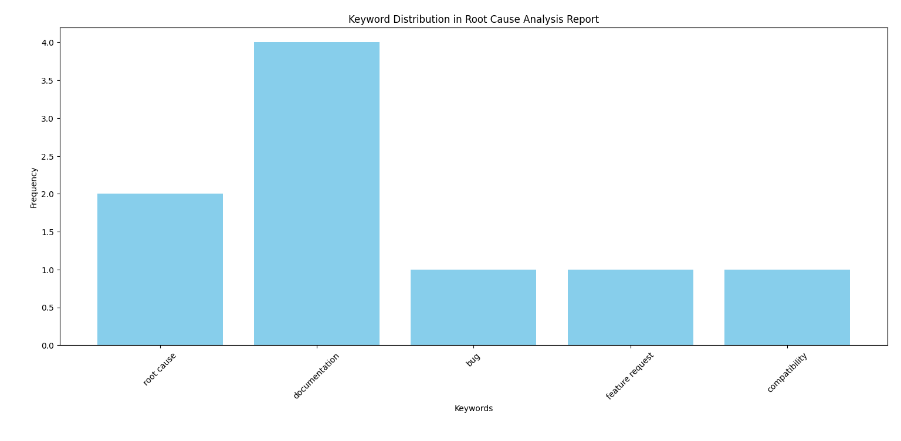

# Root-Cause-Analysis
 Leveraging LLMs for System-2 Thinking and Reasoning-Based Solutions
 
# Overview
This project demonstrates the use of Large Language Models (LLMs) to perform system-2 thinking for identifying and resolving root causes in Python GitHub issues. The pipeline processes issue descriptions, categorizes problem types, analyzes code snippets and error logs, and generates solutions. The issues are taken from the "Hello World" repository (https://github.com/octocat/Hello-World) on GitHub. The functionality is validated through testing, and case studies of resolved issues are provided.

# Features
**Data Collection:** Issues are collected from GitHub using the GitHub API and stored in `issues_data.csv`.
**Root Cause Analysis:** The script `root_cause_analysis.py` analyzes issue descriptions, error logs, and code snippets to pinpoint root causes.
**Solution Generation:** Solutions to identified issues are proposed and stored in `solutions.csv`.
**Visualization:** Insights and trends are visualized in the form of charts and saved as `Graph_Visualization.png`.
**Reporting:** A comprehensive root cause analysis report is generated and saved in `root_cause_analysis_report.csv`.

# Setup and Usage

1. **Clone the repository:**
git clone <repository_url> cd ROOT-CAUSE-ANALYSIS

2. **Install dependencies:**
Install the necessary Python libraries:
pip install -r requirements.txt

3. **Run the data collection script:**
python src/data_collection.py

4. **Analyze the collected issues:**
python src/issue_analysis.py

5. **Perform root cause analysis:**
python src/root_cause_analysis.py

6. **Generate solutions:**
python src/solution_generation.py

7. **Visualize the results:**
python src/visualization.py

Example : 

8. **Generate the analysis report:**
python src/analysis_and_reporting.py

# Testing
- Tests for the solution generation process are located in `tests/test_solution_generation.py`.
- Test results are logged in `tests/result.log`.
